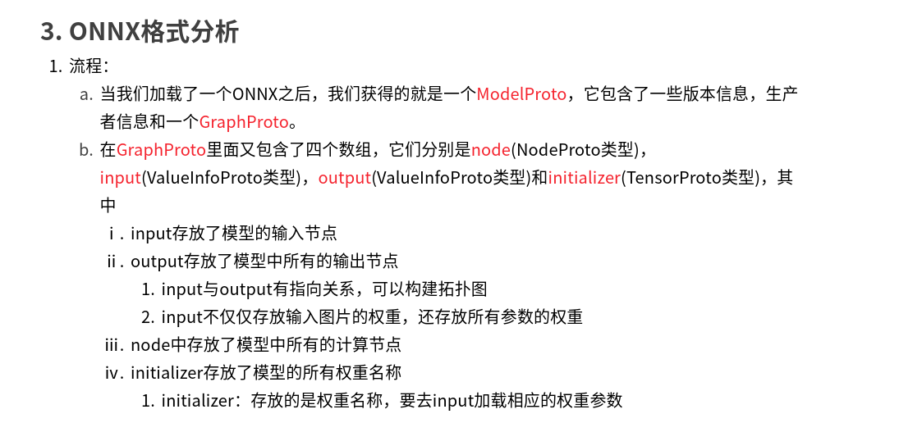

onnx 初探：https://mp.weixin.qq.com/s/H1tDcmrg0vTcSw9PgpgIIQ



# onnx to trt
cmd: onnx2trt resnet50.onnx -o resnet50.trt

# experiments:
test report:

times-type | result(ms/img) |-
---|---|---
100 times of pytorch-cpu | 128.8730549812317  |-
100 times of onnx-cpu |     83.4130311012268 |-
100 times of pytorch-gpu |  26.613991260528564  |-
100 times of tensorRt-gpu |  0.25597095489501953  |-

# Q:
- tensorRt 不支持nn.Hardswish() 改为 nn.ReLU()

- tensorRt 不支持 nn.Upsample() :重写upsample function.

#  TRT
trt download: https://developer.nvidia.com/nvidia-tensorrt-download

trt7.0 下载：https://developer.nvidia.com/nvidia-tensorrt-7x-download

export LD_LIBRARY_PATH=$LD_LIBRARY_PATH:<TensorRT-${version}/lib>

python install:

cd TensorRT-${version}/python #有python.whl安装包。

---
### onnx2trt
注：
注意各个模型工具的版本匹配关系，曾花费2天时间找yolov5转出来的模型精度与torch的精度不匹配问题。way：卸载tensorrt7.2按照tensorrt8.0;卸载cudnn7.6安装cudnn8.2
重装cuda10.2,并使用转换工具trtexec：
```python
/media/dell/data/installpkgs/TensorRT-8.0.3.4.Linux.x86_64-gnu.cuda-10.2.cudnn8.2/TensorRT-8.0.3.4/targets/x86_64-linux-gnu/bin/trtexec \
--explicitBatch \
--onnx=/home/dell/lg/code/lg_pro_sets/others/model_compression/torch2tensorrt/tmp/yolov5_with_model.pth.onnx \
--saveEngine=yolov5_with_model.trt_engine \
#--fp16 \
--workspace=10240 \
--verbose
```

