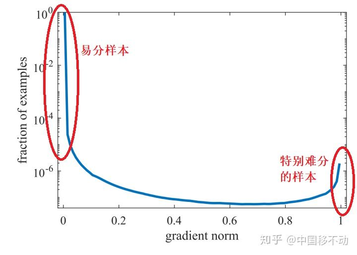
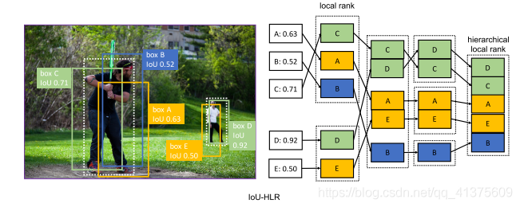
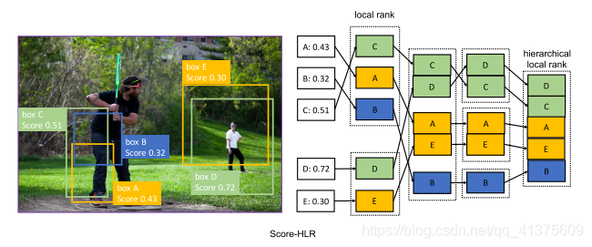
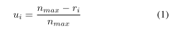
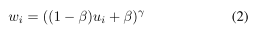

解决方法：

## online hard example mining(OHEM)
出自[Training Region-based Object Detectors with Online Hard Example Mining](https://link.csdn.net/?target=https%3A%2F%2Farxiv.org%2Fpdf%2F1604.03540.pdf)这篇文章

## S-OHEM

## Focal Loss


## class balanced cross-entropy
CE(p)=-a*y*log(y)

sigmoid_cross_entropy公式:\
-y_hat* log(sigmoid(y)) - (1 - y_hat) * log(1 - sigmoid(y))\
class_balanced_sigmoid_cross_entropy公式:\
-β*y_hat* log(sigmoid(y)) -(1-β) * (1 - y_hat) * log(1 - sigmoid(y))\
思想就是引入新的权值β，实现正负样本loss的平衡，从而实现对不同正负样本的平衡。
```python
weights = tf.constant([0.12, 0.26, 0.43, 0.17])
cost = tf.reduce_mean(tf.nn.weighted_cross_entropy_with_logits(logits=pred, targets=y, pos_weight=weights))

```
## GHM
Focal Loss存在一些问题：
    
    如果让模型过多关注 难分样本 会引发一些问题，比如样本中的离群点（outliers），已经收敛的模型可能会因为这些离群点还是被判别错误，总而言之，我们不应该过多关注易分样本，但也不应该过多关注难分样本；
    α 与 γ 的取值全从实验得出，且两者要联合一起实验，因为它们的取值会相互影响。

引入梯度模长g：g=|y-y^|\
g 正比于检测的难易程度，g 越大则检测难度越大；\
梯度模长与样本数量的关系：梯度模长接近于 0 时样本数量最多（这些可归类为易分样本），随着梯度模长的增长，样本数量迅速减少，但是当梯度模长接近于 1 时样本数量也挺多（这些可归类为难分样本）。如果过多关注难分样本，由于其梯度模长比一般样本大很多，可能会降低模型的准确度。因此，要同时抑制易分样本和难分样本！


抑制方法之梯度密度 G(D)：\
因为易分样本和特别难分样本数量都要比一般样本多一些，而我们要做的就是衰减 单位区间数量多 的那类样本，也就是物理学上的密度概念。


分类损失函数(GHM-C)和边框损失函数(GHM-R)

## PISA
Prime Sample Attention in Object Detection

ui & wi 表示损失的权重。\
!
[img_5.png](img_5.png)


