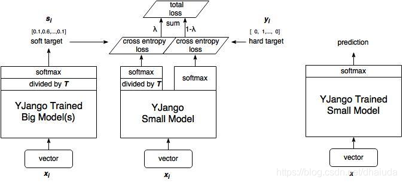

## Pruning

### Pruning Filters For Efficient ConvNets

流程:

- 训练模型获得初始权重
- 依次计算conv-Filter中所有权值的绝对值之和
- 根据求和大小排列 Filter
- 删除数值较小的 Filter （权重数值越小，代表权重的重要性越弱）
- 对删除之后的 Filter 重新组合，生成新的Filter矩阵
- 根据上一层的被修剪的通道相应修剪下一层的Filter

可以是逐层剪枝，也可以是一次修剪多层，然后重复训练来恢复精度。

---

## Distillation

[系列论文参考](https://github.com/dkozlov/awesome-knowledge-distillation)

### Distilling the Knowledge in a Neural Network

流程：

- 训练完成teacher；
- 建立student模型；
- teacher&student推理image得到结果,做改进softmax运算
- 求distill_loss = teacher&student求损失[loss_soft] or teacher取argmax&student求损失[loss_hard]
- total loss = student单独的损失[loss]+[distill_loss]
- 反向传播

注：

T就是一个调节参数，通常为1；T的数值越大则所有类的分布越‘软’（平缓）
