### Self-Attention
- 如下图所示，b1、b2、b3、b4、用Self-Attention可以同时计算，而在RNN中不能够同时被计算，即解决RNN无法并行化的问题。
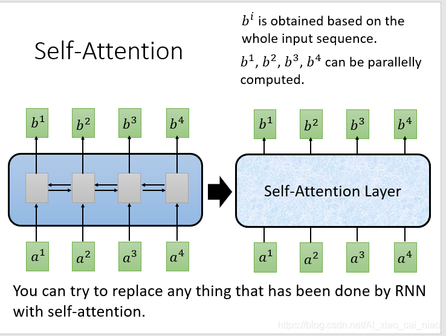
- 在把各个词送入Self-Attention之前先将其乘以一个特征矩阵，以特征化的表示各个单词，然后将其送入Self-Attention中（词嵌入的方法，Word embedding），即ai=Wxi，然后把不同的a乘上不同的矩阵W变为向量q（去匹配其他向量）、k（被匹配）、v（要被抽取出的information），如下图所示：
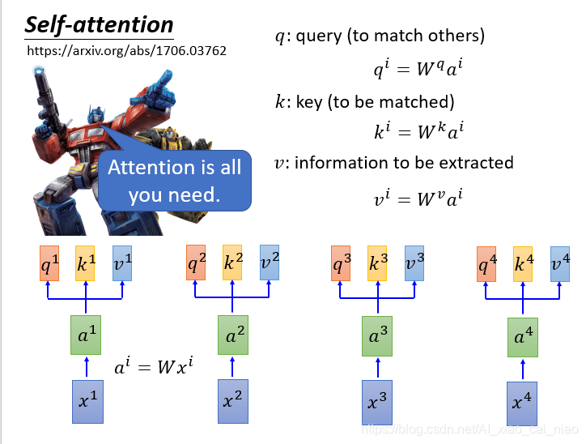
- 然后用每个向量q去对每个k做attention，这里公式除以根号d是为了平衡q和k乘的时候方差太大。如下图：
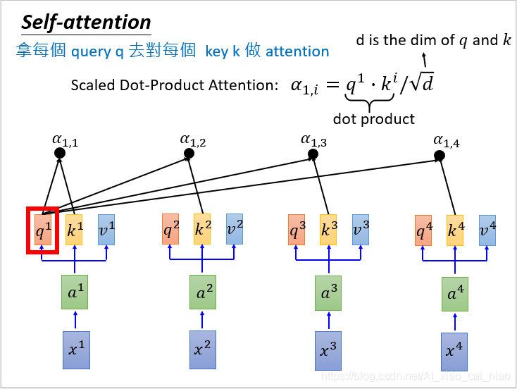
- 然后做Soft-max，如下图：
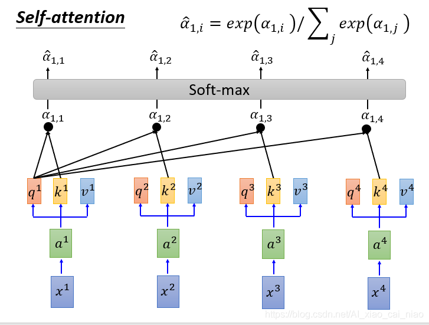
- 从下图可以看出输出的向量b1可以考虑整个句子的信息。
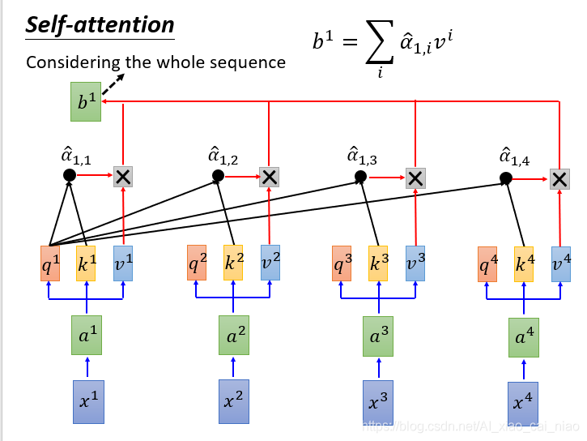
  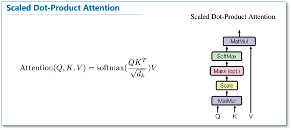
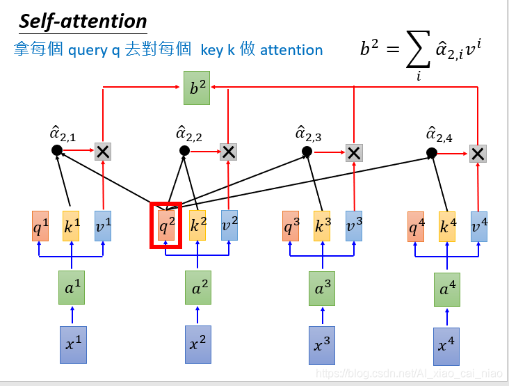
- 综上四步，其实整个框架就是下图这个样子（所有向量可以被平行化计算）
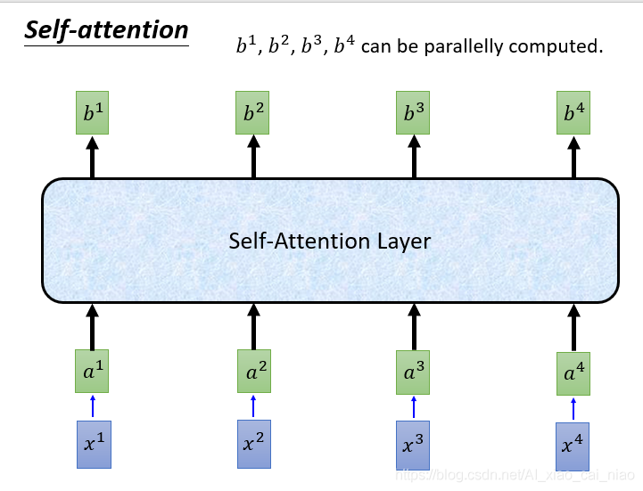
- multi-head Self-Attention
  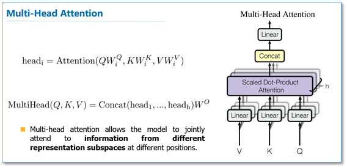
### Transformer
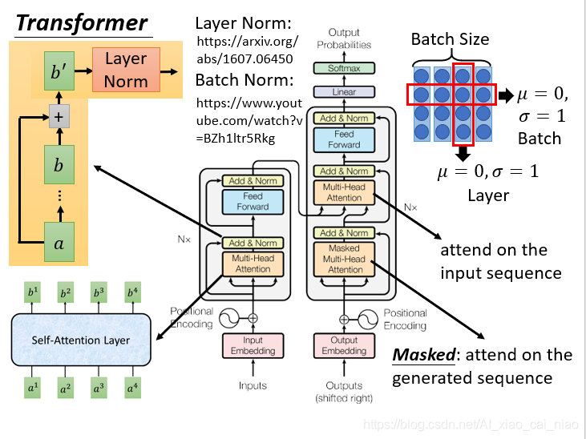
- word embedding
  文字->字向量的转换Word2Vec
- positional encoding
  eg:吃饭没、没吃饭、没饭吃、饭吃没、饭没吃，同样三个字，顺序颠倒，所表达的含义就不同了。
  记录词的位置信息：Tranformer 采用的是 sin-cos 规则，使用了 sin 和 cos 函数的线性变换来提供给模型位置信息.
  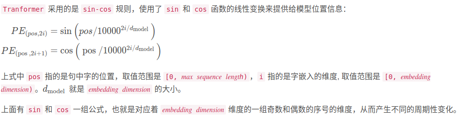
    ```python
    # 导入依赖库
    import numpy as np
    import matplotlib.pyplot as plt
    import seaborn as sns
    import math
    
    def get_positional_encoding(max_seq_len, embed_dim):
        # 初始化一个positional encoding
        # embed_dim: 字嵌入的维度
        # max_seq_len: 最大的序列长度
        positional_encoding = np.array([
            [pos / np.power(10000, 2 * i / embed_dim) for i in range(embed_dim)]
            if pos != 0 else np.zeros(embed_dim) for pos in range(max_seq_len)])
        positional_encoding[1:, 0::2] = np.sin(positional_encoding[1:, 0::2])  # dim 2i 偶数
        positional_encoding[1:, 1::2] = np.cos(positional_encoding[1:, 1::2])  # dim 2i+1 奇数
        # 归一化, 用位置嵌入的每一行除以它的模长
        # denominator = np.sqrt(np.sum(position_enc**2, axis=1, keepdims=True))
        # position_enc = position_enc / (denominator + 1e-8)
        return positional_encoding
        
    positional_encoding = get_positional_encoding(max_seq_len=100, embed_dim=16)
    plt.figure(figsize=(10,10))
    sns.heatmap(positional_encoding)
    plt.title("Sinusoidal Function")
    plt.xlabel("hidden dimension")
    plt.ylabel("sequence length")
    
    ```
  最后，[x_embedding] = [word embedding]+[positional encoding]
- 做self-attention（略）
- Add与Layer Normalization\
  layer normalization 可以避免batch不同的影响（batch normalization），计算时与其他句子无关
- forward\
  其实就是两层线性映射并用激活函数激活，比如说ReLU.
  

  


