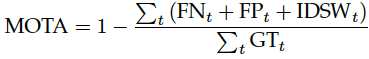
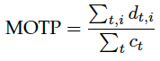

## Sort
是采用卡尔曼滤波进行位置预测和匈牙利算法进行最佳匹配的一种高效的跟踪算法

### sort流程
1、初始化跟踪器
2、卡尔曼滤波预测bbox
3、预测bbox与测量bbox做IOU,得到代价矩阵，并采用匈牙利算法得到最佳匹配
4、匹配上的box更新卡尔曼滤波器,未匹配上的初始化为新的跟踪器
5、卡尔曼滤波器输出当前box的预测值作为最终结果

### sort中卡尔曼滤波变量
<中心x, 中心y, 面积s, 宽高比r>

## DeepSort
直接使用距离度量
- 位置度量：运动马氏距离
- 特征度量：余弦距离
最后通过加权得到的最佳匹配跟踪的方法。
  
可参考：https://blog.csdn.net/weixin_38145317/article/details/104405464
  
### deepsort流程
- 特征提取（一般512维度）
- 特征的匹配获得相似度矩阵cost_matrix;
- 卡尔曼滤波对位置预测位置和测量位置距离判断，修正相似度矩阵cost_matrix；（不同位置，相同衣服的人可能匹配到一起）
- 匈牙利算法最佳匹配；
- 匹配成功的更新卡尔曼滤波器并更新特征库

### deepsort中卡尔曼滤波变量
<中心x, 中心y, 宽高比r, 高度h>

### 评价指标
- MOTA ( Multiple Object Tracking Accuracy)
  
  \
FN为False Negative，FP为False Positive，IDSW为ID Switch，GT为Ground Truth 物体的数量。MOTA考虑了tracking中所有帧中对象匹配错误，主要是FN，FP，ID Switch。MOTA给出了一个非常直观的衡量跟踪器在检测物体和保持轨迹时的性能，与物体位置的估计精度无关。MOTA取值应小于100，当跟踪器产生的错误超过了场景中的物体，MOTA会为负数。需要注意的是，此处的MOTA以及MOTP是计算所有帧的相关指标再进行平均（既加权平均值），而不是计算每帧的rate然后进行rate的平均。
- MOTP (Multiple Object Tracking Precision)
  
  \
d为检测目标i和给它分配的ground truth之间在所有帧中的平均度量距离，在这里是使用bonding box的overlap rate来进行度量（在这里MOTP是越大越好，但对于使用欧氏距离进行度量的就是MOTP越小越好，这主要取决于度量距离d的定义方式）；而c为在当前帧匹配成功的数目。MOTP主要量化检测器的定位精度，几乎不包含与跟踪器实际性能相关的信息。
  
- MT(Mostly Tracked)\
满足Ground Truth至少在80%的时间内都匹配成功的track，在所有追踪目标中所占的比例。注意这里的MT和ML与当前track的ID是否发生变化无关，只要Ground Truth与目标匹配上即可。

- ML(Mostly Lost)\
满足Ground Truth在小于20%的时间内匹配成功的track，在所有追踪目标中所占的比例

- ID Switch\
Ground Truth所分配的ID发生变化的次数

- FP (False Positive)\
当前帧预测的track和detection没有匹配上，将错误预测的track点称为FP，如图1所示。是否匹配成功与匹配时所设置的阈值有关。

- FN (False Negative)\
当前帧预测的track和detection没有匹配上，将未被匹配的ground truth点称为FN（也可以称为Miss）

- ID scores\
MOTA的主要问题是仅仅考虑跟踪器出错的次数，但是有一些场景（比如航空场景）更加关注一个跟踪器是否尽可能长的跟踪一个目标。这个问题通过构建二分图来解决，主要计算对象是IDTP、IDFP、IDFN。

### 卡尔曼滤波
（学习）
