[toc]

typora-copy-images-to: util_imgs

- 参考博客：[科技猛兽](https://zhuanlan.zhihu.com/p/342261872)
- 参考论文:[综述git](https://github.com/DirtyHarryLYL/Transformer-in-Vision)
### 名词解释
### inductive bias
归纳偏置在机器学习中是一种很微妙的概念：在机器学习中，很多学习算法经常会对学习的问题做一些假设，这些假设就称为归纳偏置(Inductive Bias)\
CNN的inductive bias应该是locality和spatial invariance，即空间相近的grid elements有联系而远的没有，和空间不变性（kernel权重共享）

## important papers
- ViT
- DeiT
- PVT
- Swin
- CoAtNet
- CVT
- CaiT/Deep-vit
- Lv-vit
- VOLO

## paper works

### DETR
#### motivation
#### methods
#### experiments

### VIT
image->patch:\
Rearrange('b c (h p1) (w p2) -> b (h w) (p1 p2 c)', p1=patch_height, p2=patch_width)
[1,3,32x10,32x10]->[1, 10x10, 32x32x3], 然后再做liner变化
ViT需要现在JFT-300M大型数据集上预训练，然后在ImageNet-1K上训练才能得到出色的结果，但这借助了额外的数据。

### DeiT
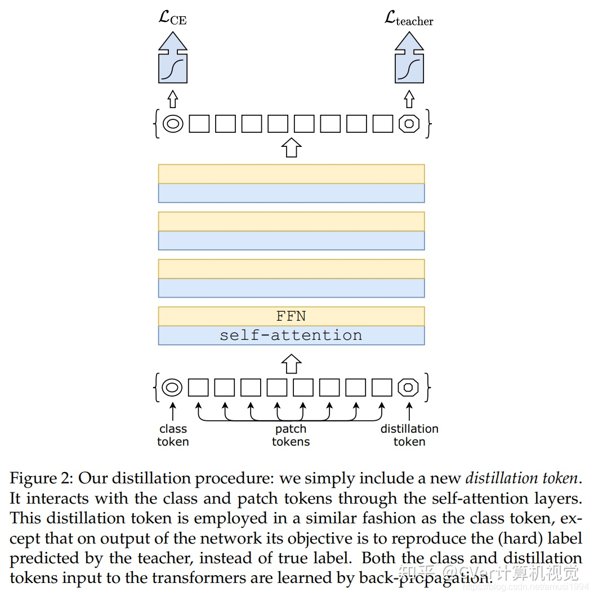
- 仅使用Transformer，不引入Conv的情况下也能达到SOTA效果。
- 提出了基于token蒸馏的策略，这种针对transformer的蒸馏方法可以超越原始的蒸馏方法。
- Deit发现使用Convnet作为教师网络能够比使用Transformer架构取得更好的效果。
### VT 
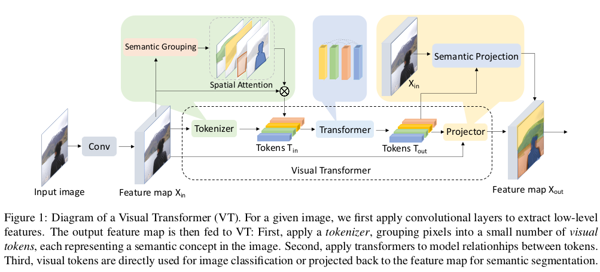

- CNN和Vision Transformer的不同点 ?
1) 传统CNN公平地对待图片的每个像素。\
传统CNN在进行计算机视觉任务时，会把图片视为均匀排列的像素阵列 (uniformly- arranged pixel arrays)，使用卷积操作来处理一些高度局部化的特征 (highly-localized features)。但是，传统卷积操作对于一张图片的不同pixel，是以相同的重要性对待的 (treat all image pixels equally)，不论这个像素的内容是什么，也不论它是否重要。 但是，这样做的确存在问题：图像分类模型应该优先考虑前景对象而不是背景。分割模型应该优先考虑行人，而不是不成比例的大片天空、道路、植被等。所以作者认为，传统CNN把图片建模为像素阵列，处理时不考虑像素的内容，也不考虑不同像素之间重要性的差异。
2) 并非所有图片都拥有全部概念。\
所有自然图像中都存在角点 (corner)和边缘 (edge)等低级特征，因此对所有图像应用低级卷积滤波器是合适的。但是，特定图像中存在耳朵形状等高级特征，因此对所有图像应用高级过滤器在计算上效率低下。
3) 卷积很难将空间上遥远的概念联系起来。\
每个卷积滤波器都被限制在一个小的区域内工作，但是语义概念之间的长期交互是至关重要的。为了联系空间距离概念 ( spatially-distant concepts)，以前的方法增加了卷积核大小 (kernel size)，增加了模型深度 (depth)，或者采用了新的操作，如dilated convolutions, global pooling, and non-local attention layers。然而，通过在像素卷积范式中工作，这些方法充其量缓解了问题，通过增加模型和计算复杂性来补偿卷积的弱点。
- VT 提出了另一种处理图片的方法Visual Transformers，即：
1) 把图片建模为语义视觉符号 (semantic visual tokens)。
2) 使用Transformer来建模tokens之间的关系。
这样一来，Visual Transformers (VT)把问题定义在了语义符号空间 (semantic token space)中，目的是在图像中表示和处理高级概念 (high-level concepts)。在token空间中建模高级概念之间的联系 (models concept interactions in the token-space)。而且，图片的不同部分，因其内容不同重要性也不同。注意，这与我们之前一直提的在像素空间 (pixel-space)中处理信息的Transformer (如ViT，DeiT，IPT等等)完全不同，因为计算量的相差了多个数量级。
作者使用空间注意力机制将特征图转换成一组紧凑的语义符号 (semantic tokens)。再把这些tokens输入一个Transformer，利用Transformer特殊的功能来捕捉tokens之间的联系。
这样一来，VT可以：
1) 关注那些相对重要区域，而不是像CNN那样平等地对待所有的像素。
2) 将语义概念编码在视觉符号 (visual tokens)中，而不是对所有图像中的所有概念进行建模。
3) 使用Transformer来建模tokens之间的关系。

### BotNet
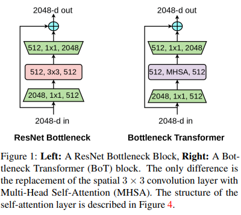\
谷歌出品，BotNet即将ResNet中的第4个block中的bottleneck替换为MHSA（Multi-Head Self-Attention）模块，形成新的模块，取名叫做Bottleneck Transformer (BoT) 。最终由BoT这样的block组合成的网络结构就叫做BotNet。
在分类任务中，在 ImageNet上取得了84.7%的top-1准确性。并且比 EfficientNet快2.33倍。BotNet，一个新的基于attention思想的网络结构，效果优于 SENets， EfficientNets。
### ConVit
#### motivation
在视觉任务上非常成功的 CNN 依赖于架构本身内置的两个归纳偏置特性。局部相关性：邻近的像素是相关的；权重共享：图像的不同部分应该以相同的方式处理，无论它们的绝对位置如何。
相比之下，基于自注意力机制的视觉模型（如 DeiT 和 DETR）最小化了归纳偏置。当在大数据集上进行训练时，这些模型的性能已经可以媲美甚至超过 CNN 。但在小数据集上训练时，它们往往很难学习有意义的表征。
这就存在一种取舍权衡：CNN 强大的归纳偏置使得即使使用非常少的数据也能实现高性能，但当存在大量数据时，这些归纳偏置就可能会限制模型。相比之下，Transformer 具有最小的归纳偏置，这说明在小数据设置下是存在限制的，但同时这种灵活性让 Transformer 在大数据上性能优于 CNN。
为此，Facebook 提出的 ConViT 模型使用 soft 卷积归纳偏置进行初始化，模型可以在必要时学会忽略这些偏置。
#### methods
ConViT 在 vision Transformer 的基础上进行了调整，以利用 soft 卷积归纳偏置，从而激励网络进行卷积操作。同时最重要的是，ConViT 允许模型自行决定是否要保持卷积。为了利用这种 soft 归纳偏置，研究者引入了一种称为「门控位置自注意力（gated positional self-attention，GPSA）」的位置自注意力形式，其模型学习门控参数 lambda，该参数用于平衡基于内容的自注意力和卷积初始化位置自注意力。
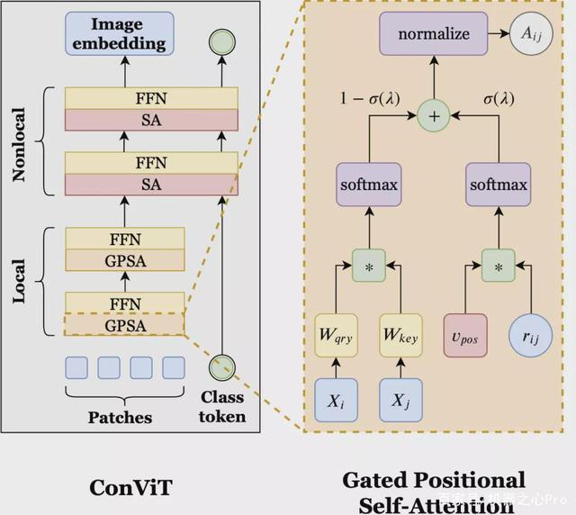
如上图所示，ConViT（左）在 ViT 的基础上，将一些自注意力（SA）层用门控位置自注意力层（GPSA，右）替代。因为 GPSA 层涉及位置信息，因此在最后一个 GPSA 层之后，类 token 会与隐藏表征联系到一起。\
除了 ConViT 的性能优势外，门控参数提供了一种简单的方法来理解模型训练后每一层的卷积程度。查看所有层，研究者发现 ConViT 在训练过程中对卷积位置注意力的关注逐渐减少。对于靠后的层，门控参数最终会收敛到接近 0，这表明卷积归纳偏置实际上被忽略了。然而，对于起始层来说，许多注意力头保持较高的门控值，这表明该网络利用早期层的卷积归纳偏置来辅助训练。

### CeiT
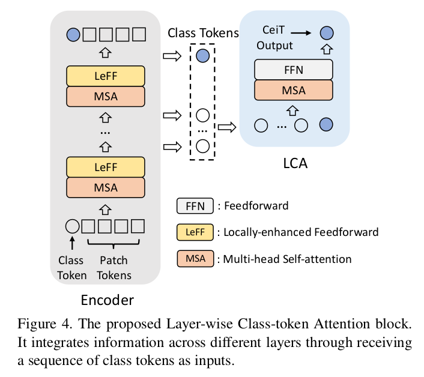
#### motivation
纯Transformer架构通常需要大量的训练数据或额外的监督才能获得与卷积神经网络（CNN）相当的性能。
#### methods
- Image-to-Tokens with Low-level Features:\
I2T(x)=MaxPool(BN(Conv(x)))
- Locally-Enhanced Feed-Forward Network\
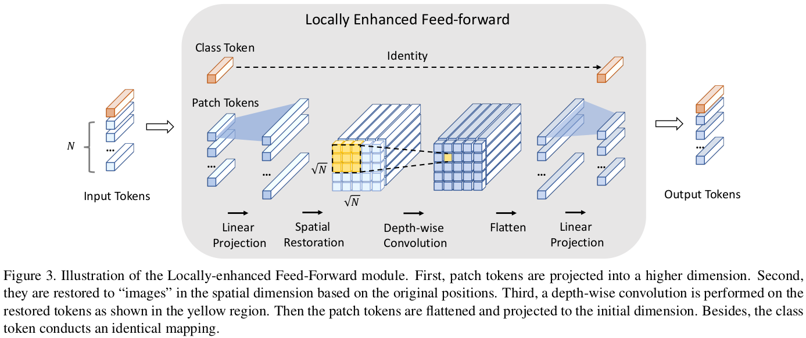
- LCA(Layer-wise Class-Token Attention)
#### experiments
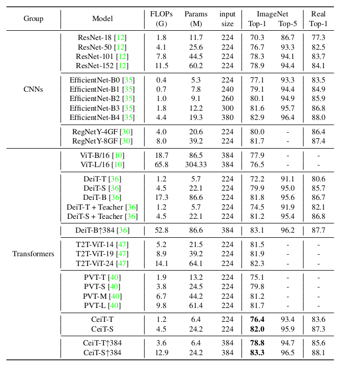

### LocalVit:Bringing Locality to Vision Transformers
#### motivation
transformer 模型具有很好的全局关联性，但是图像同时需要局部关联性机制，因此在transformer中引入conv.
#### methods
很简单在FFN网络中添加一个DWConv\
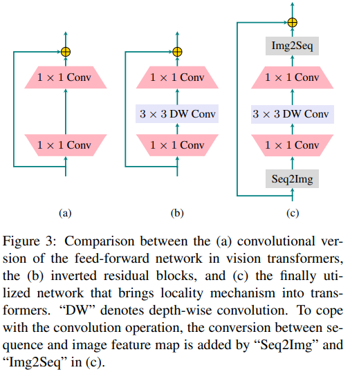
#### experiments
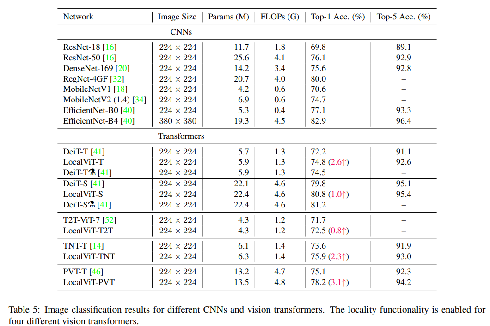

### CPVT:Conditional Positional Encodings for Vision Transformers
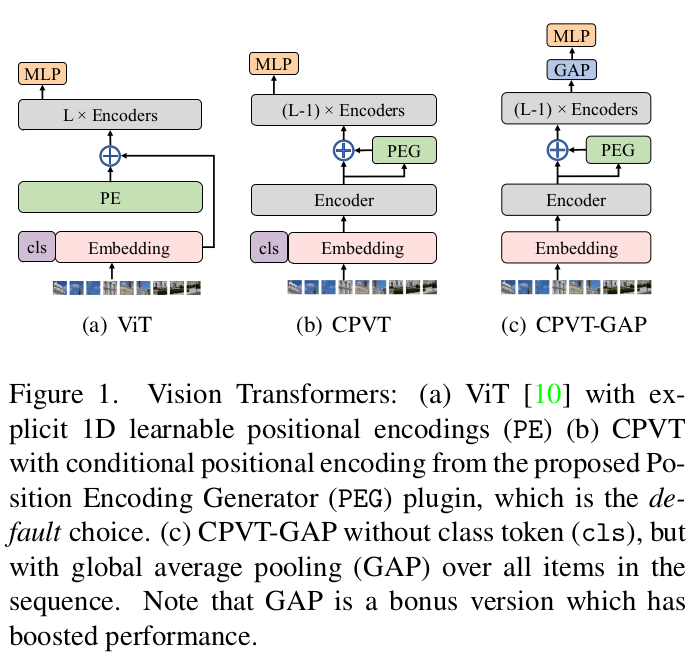
#### motivation
在 ViT 和 CPVT 的实验中，我们可以发现没有位置编码的 Transformer 性能会出现明显下降。除此之外，在 Table 1 中，可学习（learnable）的位置编码和正余弦（sin-cos）编码效果接近，2D 的相对编码（2D RPE）性能较差，但仍然优于去掉位置编码的情形。\
显式的位置编码限制了输入尺寸，因此美团这项研究考虑使用隐式的根据输入而变化的变长编码方法。该研究提出了条件编码生成器 PEG（Positional Encoding Generator），来生成隐式的位置编码
#### methods
在 PEG 中，将上一层 Encoder 的 1D 输出变形成 2D，再使用变换模块学习其位置信息，最后重新变形到 1D 空间，与之前的 1D 输出相加之后作为下一个 Encoder 的输入，如Figure所示。这里的变换单元（Transoformation unit）可以是 Depthwise 卷积、Depthwise Separable 卷积或其他更为复杂的模块
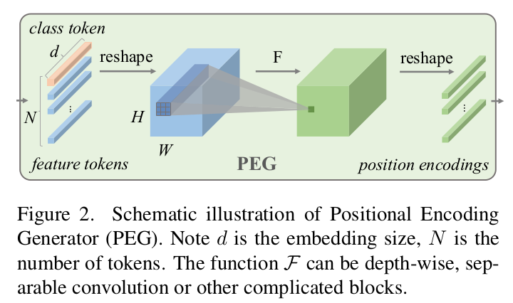

#### experiments
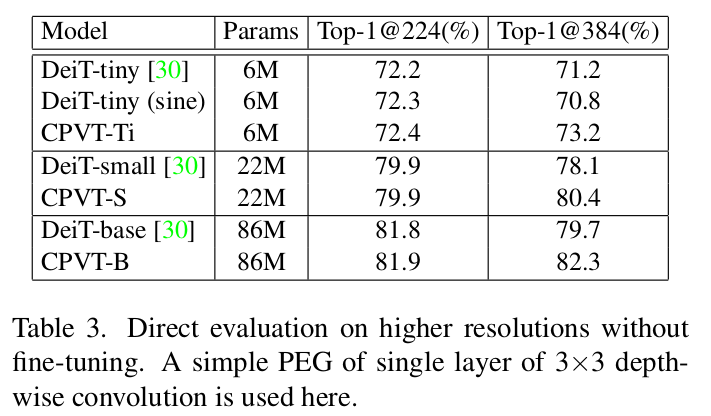

### ResT:An Efficient Transformer for Visual Recognition
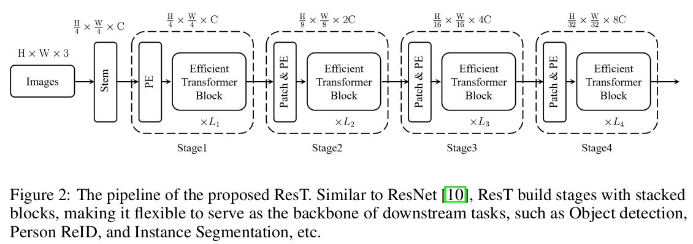
#### motivation
传统的transformer采用标准的Transformer架构,固定的像素来处理图片。作者想变变。
#### methods
不同于现有采用固定分辨率+标准Transformer模块的Transformer模型，它有这样几个优势：

(1) 提出了一种内容高效的多头自注意力模块，它采用简单的深度卷积进行内存压缩，并跨注意力头维度进行投影交互，同时保持多头的灵活性；

(2) 将位置编码构建为空域注意力，它可以更灵活的处理任意分辨率输入，且无需插值或者微调；

(3) 并未在每个阶段的开始部分进行序列化，我们把块嵌入设计成重叠卷积堆叠方式。

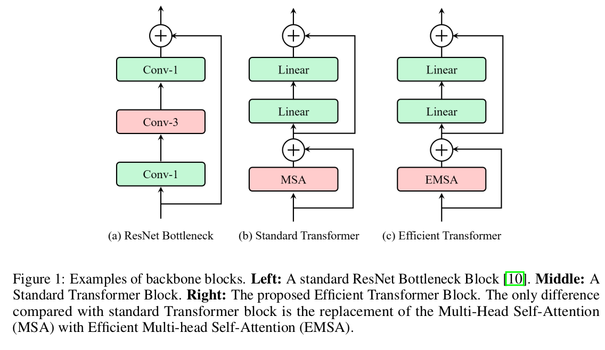
- EMSA

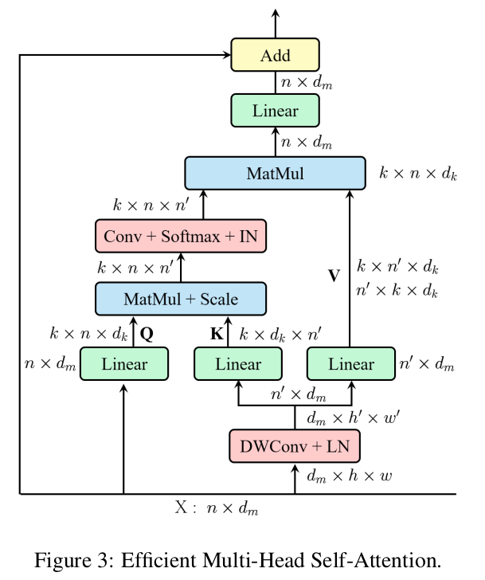

可以作为通用的backbone使用。
#### experiments
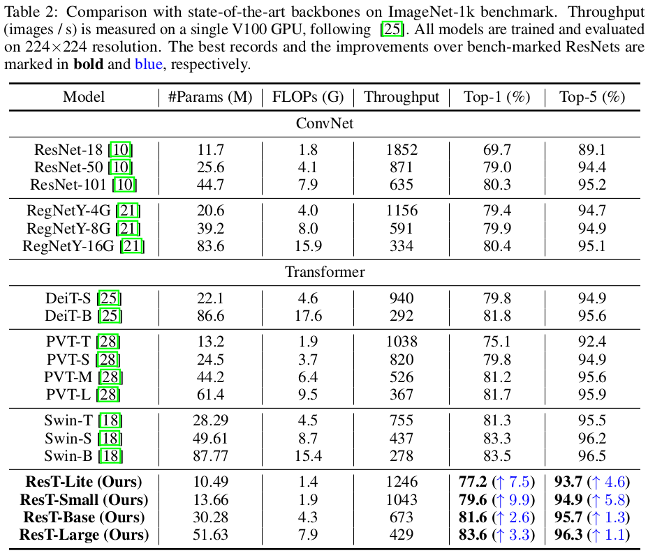
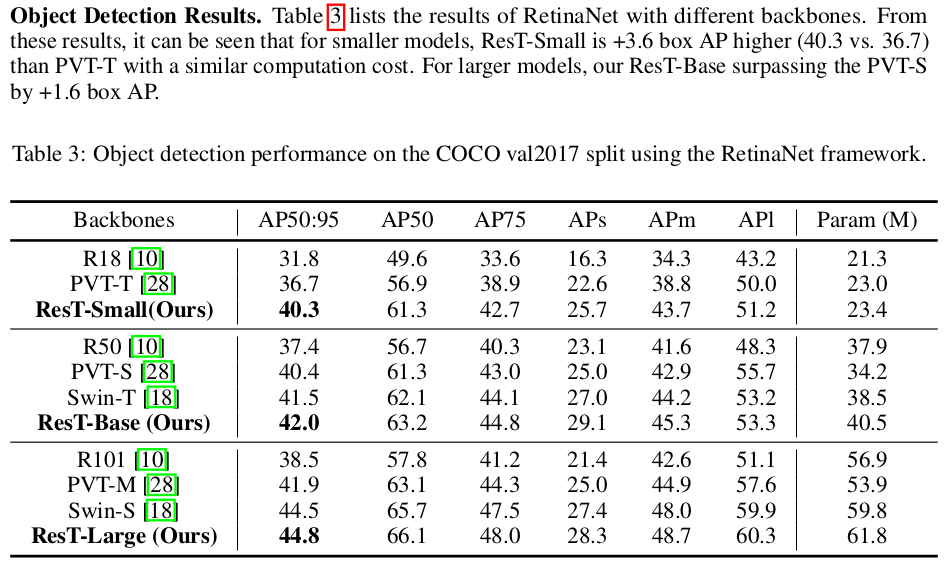

### Early Conv.:Early Convolutions Help Transformers See Better
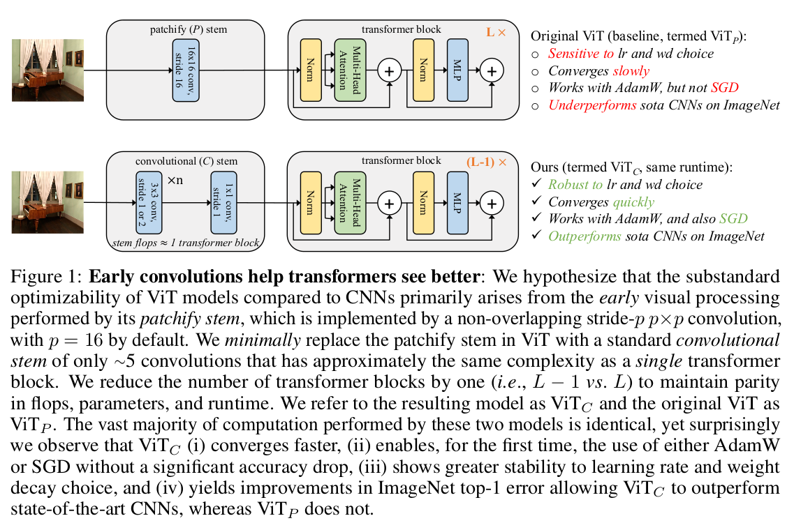
#### motivation
they are sensitive to the choice of optimizer (AdamW vs. SGD), optimizer hyperparameters, and training schedule length. In comparison, modern convolutional neural
networks are easier to optimize.Why is this the case? VIT直接训练不稳定，模型的结果对优化器，超参选择，训练计划等很敏感，作者要找原因。
#### methods
- 等价vit的16x16的patches（patchify stem）
  
  ViT_P原始的ViT将输入图片划分成无重叠的pxp个patch，然后对每个patch进行patch projection转化成d为的feature vector。假设输入的图片尺寸为224x224，每个patch的尺寸为p=16，那么patch的数量为14x14，patch projection等价于一个16x16大小，步长为16的大卷积核
- Convolutional stem design 设计对比卷积模型

    为了跟patchify stem的输出维度对齐，convolutional stem通过3x3卷积快速下采样到14x14。
- 结论
    本文通过3个稳定性实验，一个最佳性能实验完美展现了convolutional stem相较于patchify stem的优越性。4个结论：
    1.   收敛更快
    2.   可以使用SGD优化
    3.   对learning rate和weight decay更稳定
    4.   在ImageNet上提升了1-2个点
    

#### experiments
图略）结论：本文证明了ViT模型的优化不稳定是由于ViT的patchify stem的非常规大步长、大卷积核引起的。仅仅通过将ViT的patchify stem修改成convolutional stem，就能够提高ViT的稳定性和鲁棒性，非常的简单实用。但是为什么convolutional stem比patchify stem更好，还需要进一步的理论研究。最后作者还提到72GF的模型虽然精度有所改善，但是仍然会出现一种新的不稳定现象，无论使用什么stem，都会导致训练误差曲线图出现随机尖峰。

### CoAtNet：Marrying Convolution and Attention for All Data Sizes
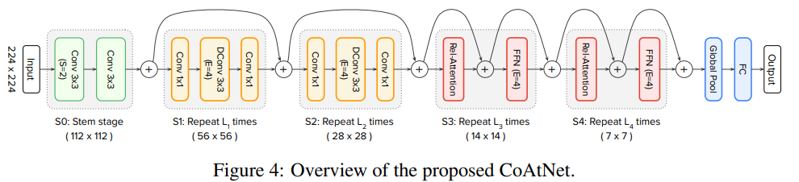
#### motivation
Transformers have attracted increasing interests in computer vision, but they still fall behind state-of-the-art convolutional networks. In this work, we show that
while Transformers tend to have larger model capacity, their generalization can be worse than convolutional networks due to the lack of the right inductive bias.\
作者认为transformer 缺少正确的归纳偏置，从而比传统conv差点儿。作者要结合两个一起搞事。
#### methods

#### experiments
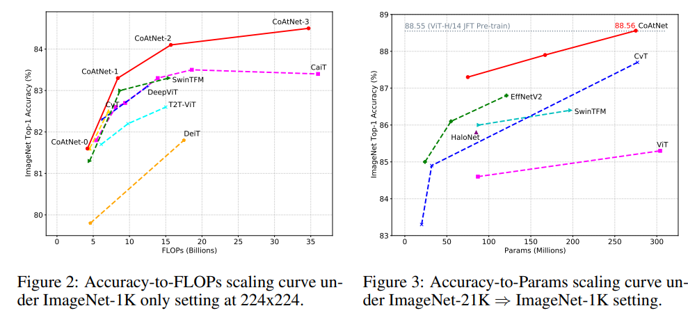
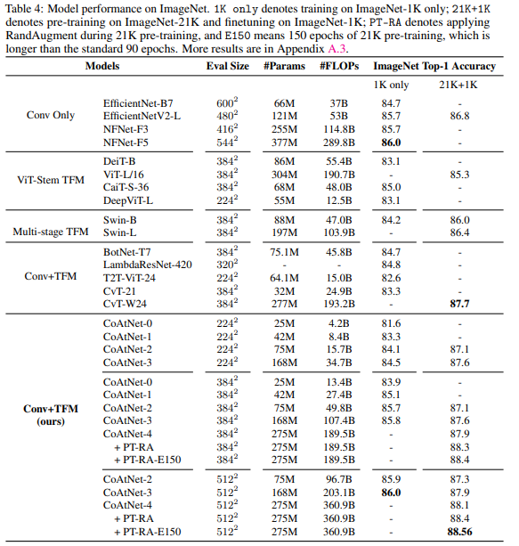

### TNT
#### motivation
...
#### methods
put transformer in transformer.
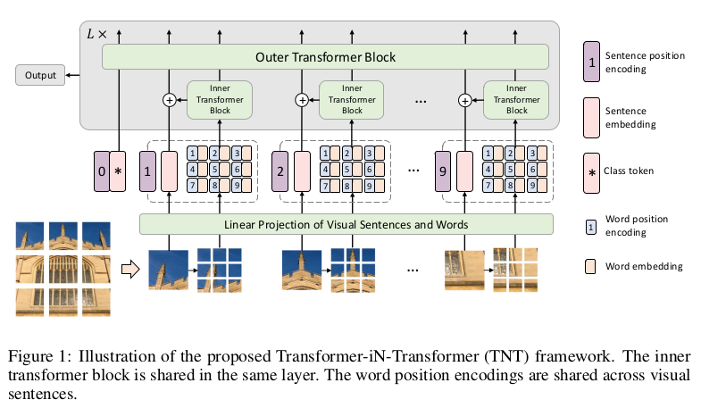
#### experiments
...

### Swin-T
#### motivation
图像的大尺度变化和大像素，使得这和文字的计算量完全不一样。作者要整点高效的，计算量小的，不一样的。
#### methods
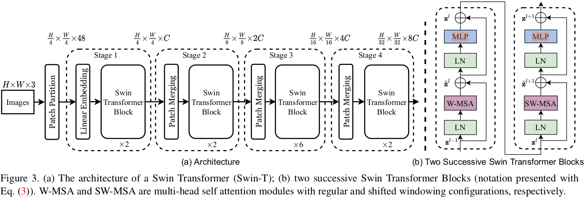
- patch partition 先降采样 
- 再用w/sw-MSA的小窗口来降低计算量。

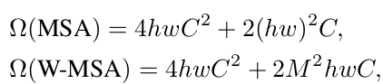
  
- 用masked msa来屏蔽无相关且别拼接在一起的window
  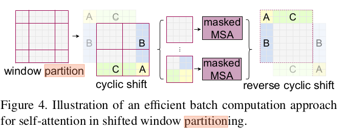
#### experiments
跟换这个backbone后，涨点惊人：

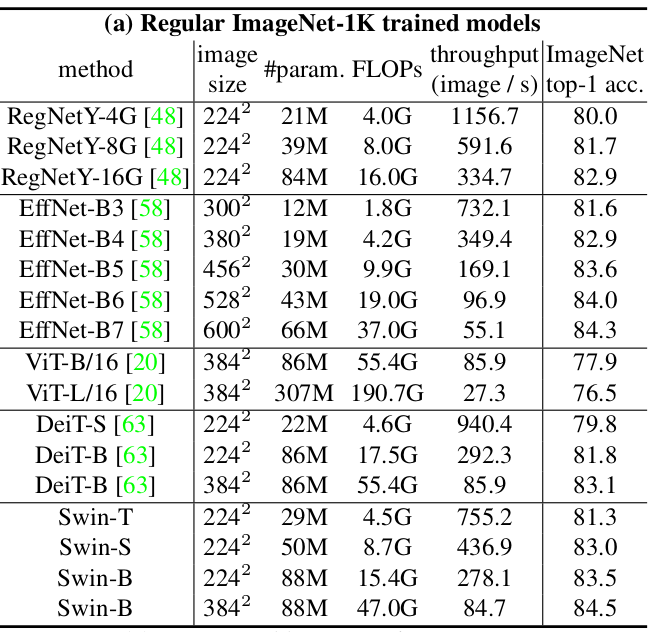
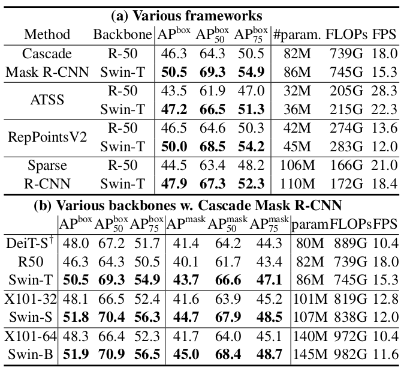

### Cait
#### motivation
#### methods
- LayerScale：使Deep Vision Transformer易于收敛，并能提高精度。
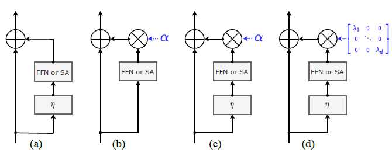
  
(d)中的操作就是本文提出的LayerScale操作了。具体做法是保持Layer Normalization，并对Self-attention或者FFN的输出乘以一个对角矩阵,都是可学习的参数.
  
- class-attention layers：高效的处理class token的方式。
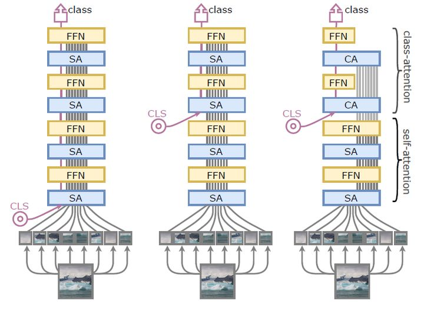\
ViT在优化参数时，其实是要class token及其后续层的对应的class embedding同时做到2件事情，即：
1. 引导attention过程，帮助得到attention map。
2. 这些token还要输入到classifier中，完成分类任务。

作者认为class embedding要同时做到这2件事其实有点矛盾，参数会朝着矛盾的方向优化。
所以作者想能不能把class token往后放，为啥要往后放呢？
主要是想让class token不参与前面的Self-attention，
使得参数的优化方向尽量不产生矛盾。
#### experiments
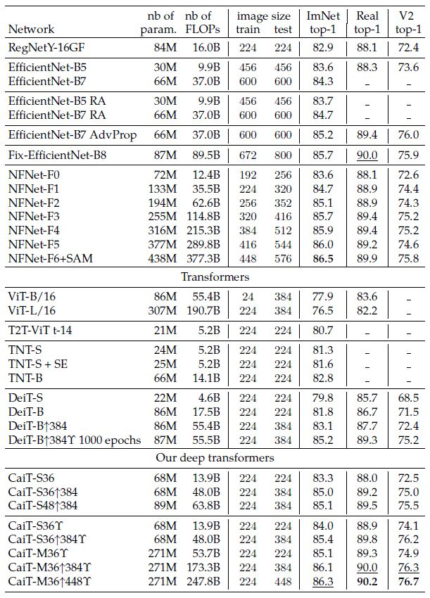

### T2T-VIT
#### motivation
作者认为，使用中等大小的数据集 (如 ImageNet) 训练时，目前视觉 Transformer 的性能相比于很普通的 CNN 模型 (比如 ResNet) 更低的原因有2点：

ViT 处理图片的方式不够好，无法建模一张图片的局部信息。

ViT 的自注意力机制的 Backbone 不如 CNN 设计的好。
 
ViT 的做法，分块操作的核心就是这句话：
self.proj = nn.Conv2d(in_chans, embed_dim, kernel_size=patch_size, stride=patch_size)

这是一个的卷积操作，输入 channel 数是3，输出 channel 数是embed_dim=768/384/192，我们称之为 patchify stem。
#### methods
- Restructurization 和 Soft Split (SS)

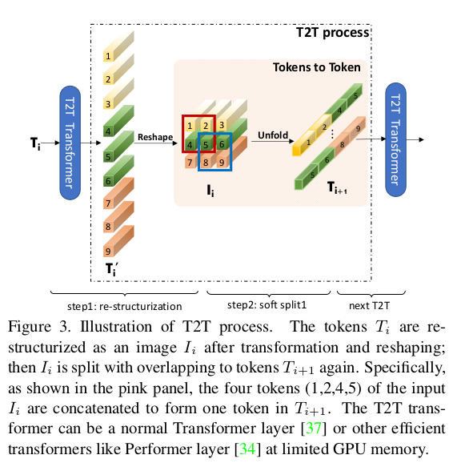
- T2T-ViT Backbone
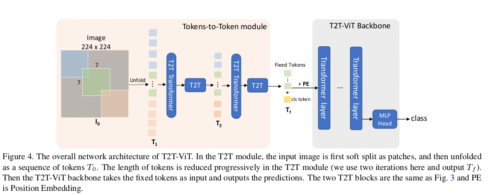
T2T-ViT Backbone 所解决的问题是 ViT 模型的许多 channels 都是冗余的，为了设计一种更高效的 Backbone，同时增加 feature map 的丰富性，作者借鉴了一些 CNN 的 Backbone 架构设计方案，每个 Transformer Block 都有残差链接，这一点和 ResNet 比较相像，所以作者借鉴了5种 CNN 的 Backbone：
  
借鉴 DenseNet：使用 Dense 连接。借鉴 Wide-ResNets：Deep-narrow vs. shallow-wide 结构对比。借鉴 SE 模块：使用 Channel attention 结构。借鉴 ResNeXt：在注意力机制中使用更多的 heads。借鉴 GhostNet：使用 Ghost 模块。

经过比较作者得出了2个结论：
    使用 Deep-narrow 架构，并减少 embedding dimension 更适合视觉 Transformer，可以增加特征的丰富程度。同时减少 embedding dimension 也可以降低计算量。SE 模块的 Channel attention 结构也可以提升 ViT 的性能，但是效果不如前者。
#### experiments
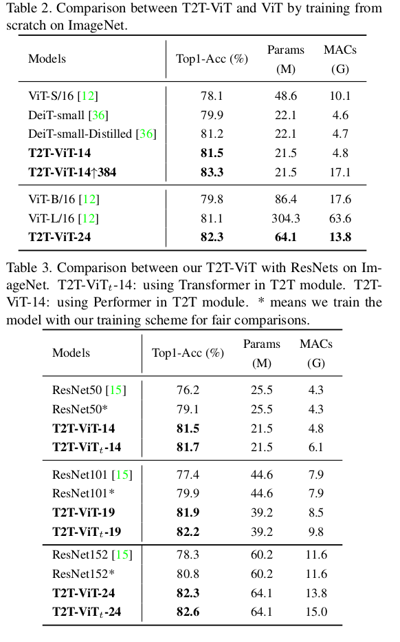

### PVT
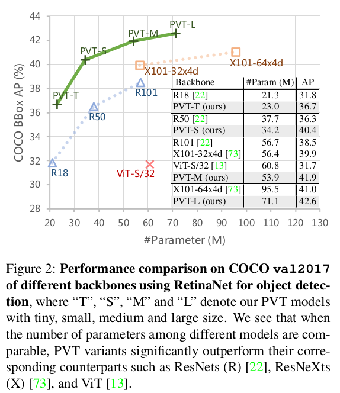
#### motivation
作者要做一个通用的backbone ，the first one of transformer
#### methods
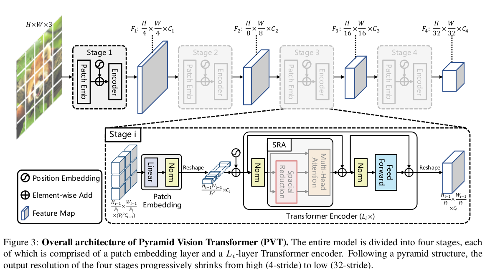
#### experiments
略

### DETR
#### motivation
目标检测的任务是要去预测一系列的Bounding Box的坐标以及Label， 现代大多数检测器通过定义一些proposal，anchor或者windows，把问题构建成为一个分类和回归问题来间接地完成这个任务。文章所做的工作，就是将transformers运用到了object detection领域，取代了现在的模型需要手工设计的工作，并且取得了不错的结果。

#### methods
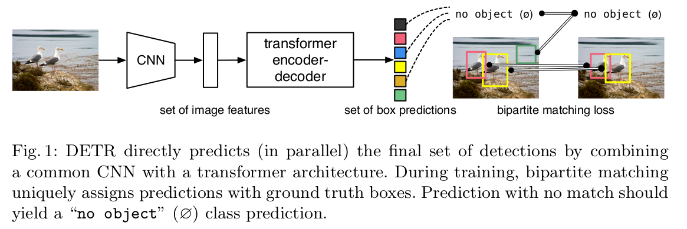
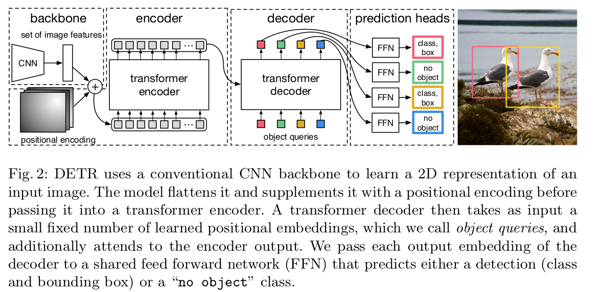
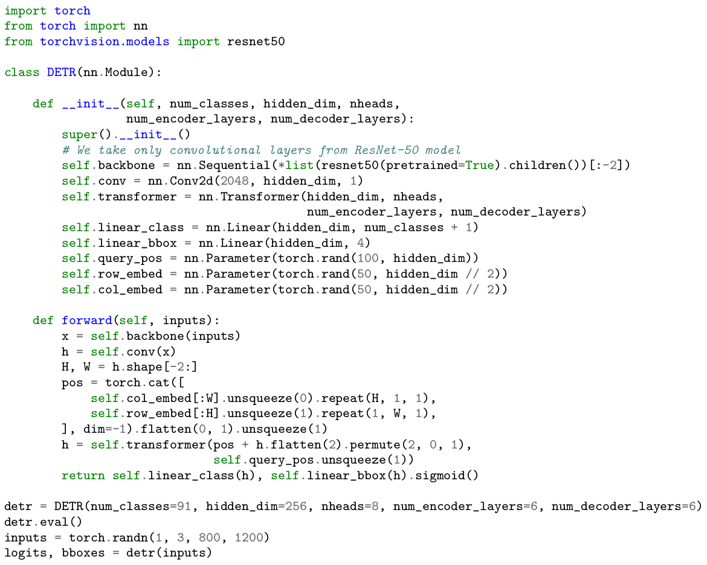
用对应的gt & giou & l1 作为代价矩阵，找到例如（100,8（目标个数））的代价矩阵。
从而计算出index ,从logits（非index部分赋值背景0） & bboxes中取出对应的正样本计算损失。

#### experiments
略

### Deformable DETR
#### motivation
DETR缺点：
训练时间极长：相比于已有的检测器，DETR需要更久的训练才能达到收敛(500 epochs)，比Faster R-CNN慢了10-20倍。
计算复杂度高：发现DETR对小目标的性能很差，现代许多种检测器通常利用多尺度特征，从高分辨率(High Resolution)的特征图中检测小物体。但是高分辨率的特征图会大大提高DETR复杂度。

产生上面2个问题的原因是：

在初始化阶段， attention map 对于特征图中的所有pixel的权重是Uniform的，导致要学习的注意力权重集中在稀疏的有意义的位置这一过程需要很长时间，意思是 attention map 从Uniform到Sparse and meaningful需要很久。
attention map 是 NQXNK 的，在图像领域我们一般认为 NQ=NK=N=H*W 所以里面的weights的计算是像素点数目的平方。 因此，处理高分辨率特征图需要非常高的计算量，存储也很复杂。
Deformable DETR的提出就是为了解决上面的2个问题，
即：收敛速度慢和计算复杂度高的问题。
它主要利用了可变形卷积(Deformable Convolution)的稀疏空间采样的本领，以及Transformer的对于相关性建模的能力。
针对此提出了一种 deformable attention module ，这个东西只关注一个feature map中的一小部分关键的位置，
起着一种pre-filter的作用。这个deformable attention module可以自然地结合上FPN，我们就可以聚集多尺度特征。
所以，作者就使用它来替换Transformer的attention module 。
#### methods
-  deformable attention module
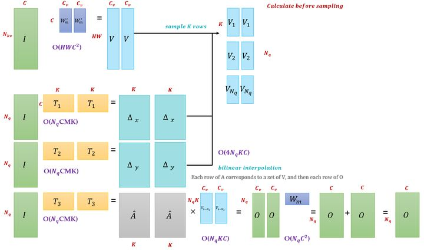
   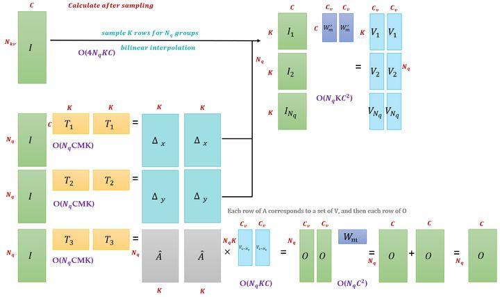
   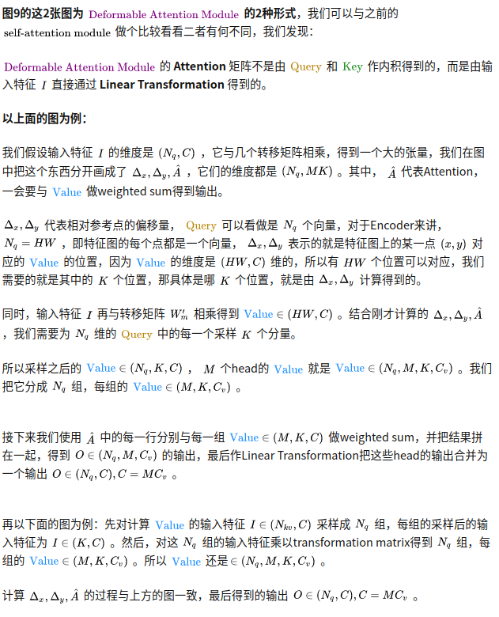
   参考：https://zhuanlan.zhihu.com/p/342261872
#### experiments
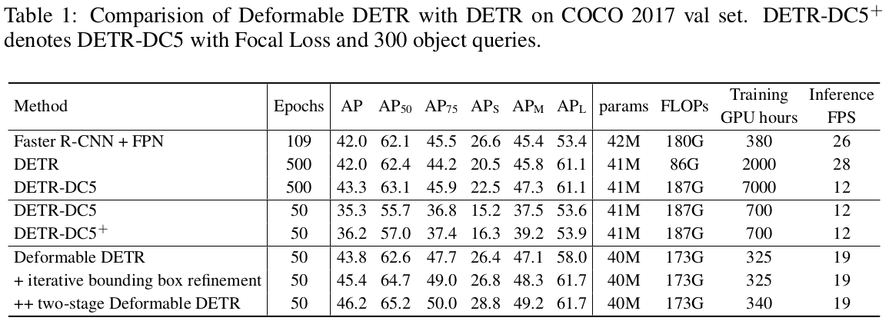

### lv-vit
#### motivation
#### methods
#### experiments

