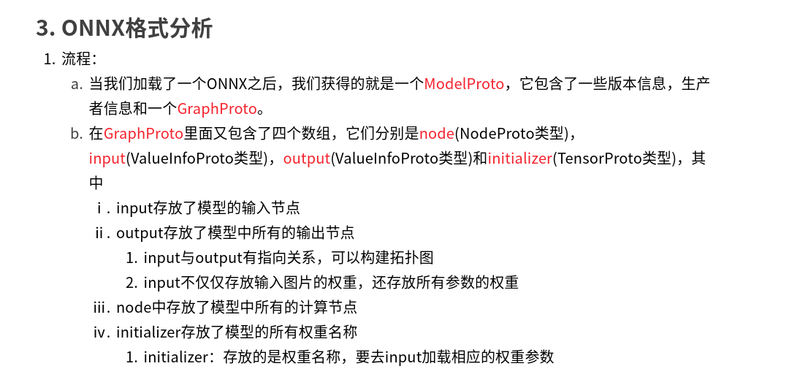
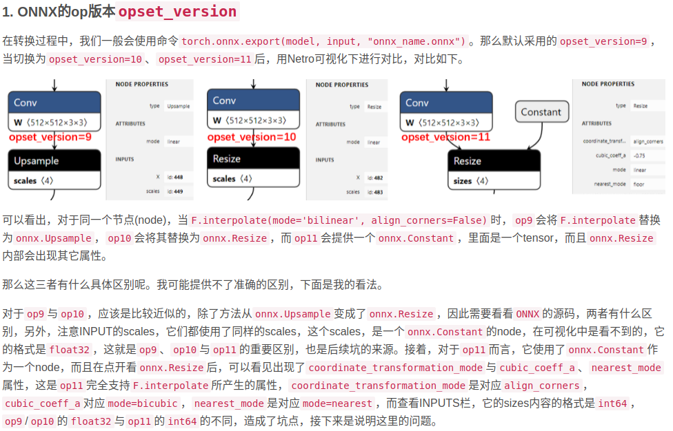

onnx 初探：https://mp.weixin.qq.com/s/H1tDcmrg0vTcSw9PgpgIIQ

# onnx to trt
cmd: onnx2trt resnet50.onnx -o resnet50.trt

# experiments:
test report:

times-type | result(ms/img) |-
---|---|---
100 times of pytorch-cpu | 128.8730549812317  |-
100 times of onnx-cpu |     83.4130311012268 |-
100 times of pytorch-gpu |  26.613991260528564  |-
100 times of tensorRt-gpu |  0.25597095489501953  |-

# Q:
- tensorRt 不支持nn.Hardswish() 改为 nn.ReLU()

- tensorRt 不支持 nn.Upsample() :重写upsample function.

#  TRT
trt download: https://developer.nvidia.com/nvidia-tensorrt-download

trt7.0 下载：https://developer.nvidia.com/nvidia-tensorrt-7x-download

export LD_LIBRARY_PATH=$LD_LIBRARY_PATH:<TensorRT-${version}/lib>

python install:

cd TensorRT-${version}/python #有python.whl安装包。

