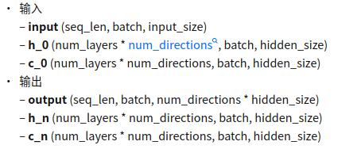

## shape
RNN shape为: (T, N, C)
- T表示序列长度
- N表示训练的batch size长度
- C则表示词向量长度

## LSTM

examples::
```python
 rnn = nn.LSTM(10, 20, 2)
 input = torch.randn(5, 3, 10)
 h0 = torch.randn(2, 3, 20)
 c0 = torch.randn(2, 3, 20)
 output, (hn, cn) = rnn(input, (h0, c0))
```



## Linear
```python
fc = nn.Linear(in_features, out_features, bias=False)
x = torch.randn((b, in_features))
y = fc(x)
y->(b, out_features)
```


