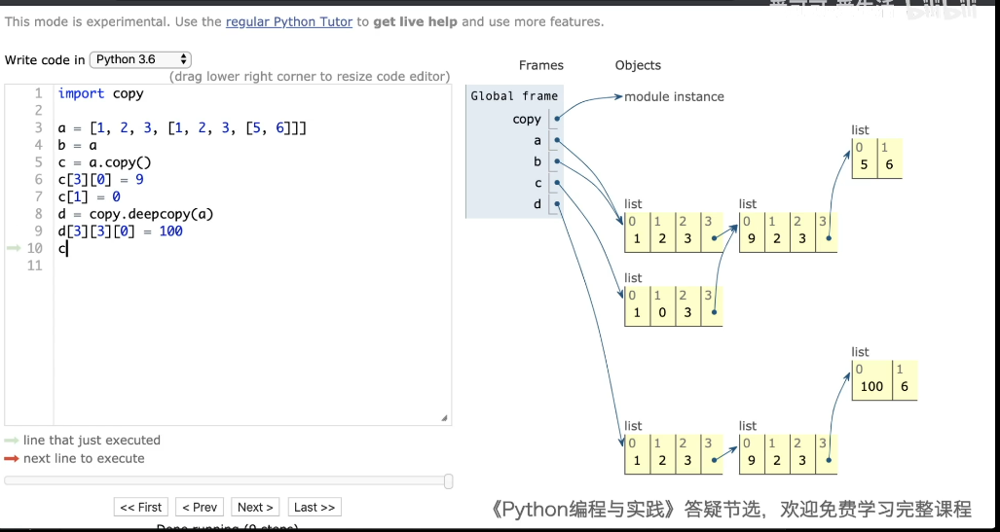

## 一目了然图

## 不可变对象的拷贝->Python 的引用计数
地址不变

Python 的引用计数:
因为我们这里操作的是不可变对象，Python 用引用计数的方式管理它们，所以 Python 不会对值相同的不可变对象申请单独的内存空间。只会记录它的引用次数.

##浅拷贝
只拷贝数据里的不可变对象，数据里的可变元素地址依然不变。
## 深拷贝
全部拷贝数据里的所有可变及不可变对象，并新创一个地址保存。
